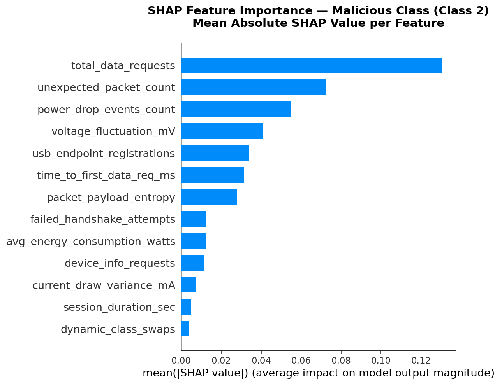
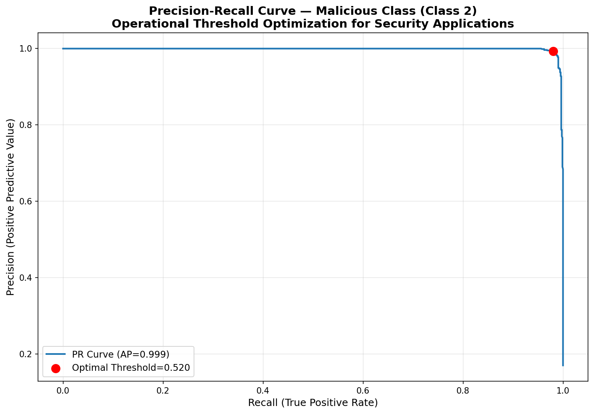

# usb-security-behavioral-analysis

# USB-Charging-Threat-Detection

[](https://www.python.org/downloads/)
[]()
[]()

## Overview
A behavioral-based security architecture designed to mitigate hardware-layer vulnerabilities such as **Juice Jacking** and **BadUSB** (HID spoofing). 

Modern mobile kernels rely on static, binary "trust-on-connect" handshakes. This project explores moving beyond static perimeters by implementing a dynamic, kernel-level behavioral analysis pipeline that monitors hardware telemetry to detect malicious charging sessions in real time.

## Architecture
The pipeline operates on 13 distinct features, spanning:
*   **Analog Physical Layers:** Detecting electromagnetic interference (EMI) ripples and voltage fluctuations indicative of hidden microcontroller switching regulators.
*   **Protocol Layers:** High-resolution monitoring of USB data request frequencies and payload entropy.

### Key Engineering Features
*   **Operational Calibration:** Rather than raw binary classification, the model utilizes `CalibratedClassifierCV` (Isotonic Regression) to extract genuine confidence intervals for kernel-level decision making.
*   **Explainable AI (XAI):** Integrated `SHAP` (TreeExplainer) to map decision boundaries, ensuring the model's threat interception is verifiable and auditable.
*   **Adversarial Resilience:** The ensemble architecture was stress-tested against adaptive payloads with 30% feature-space perturbation to simulate real-world evasion.
*   **Zero-Day Engine:** An unsupervised `Isolation Forest` trained solely on benign baselines acts as a fallback layer for structural anomalies.

## Performance Metrics

| Metric | Result |
| :--- | :--- |
| **Test Accuracy** | 99.20% |
| **Adversarial Detection Rate** | 98.12% |
| **Zero-Day Recall** | 96.59% |
| **Inference Latency** | ~227 µs/sample |
| **Memory Footprint** | 57.87 MB |

## Pipeline Visualization
*(Insert your exported images here)*




## Installation & Usage

### Prerequisites
Ensure you have the required dependencies installed:
```bash
pip install -r requirements.txt
